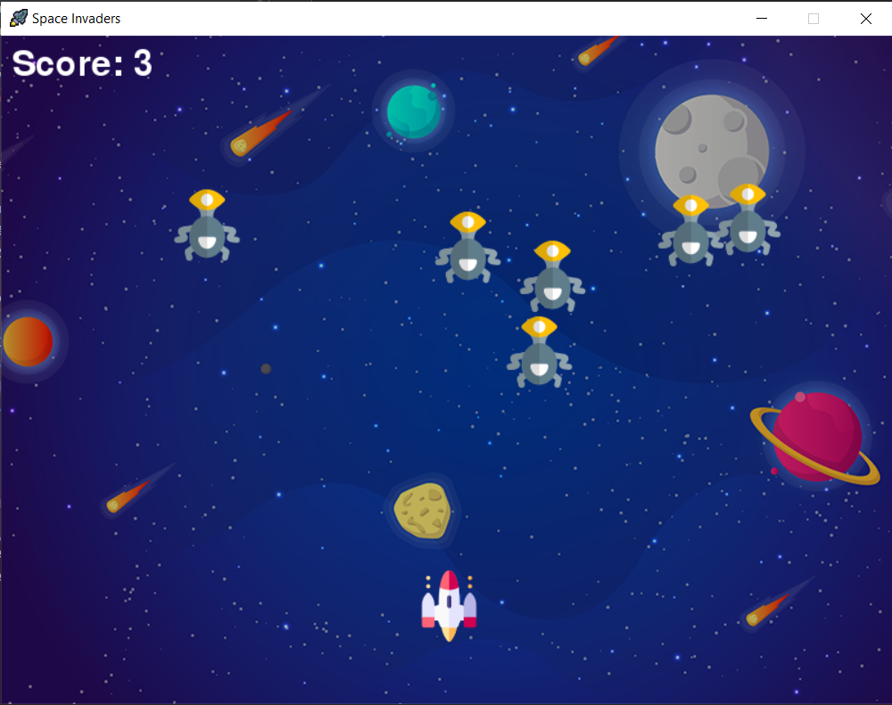
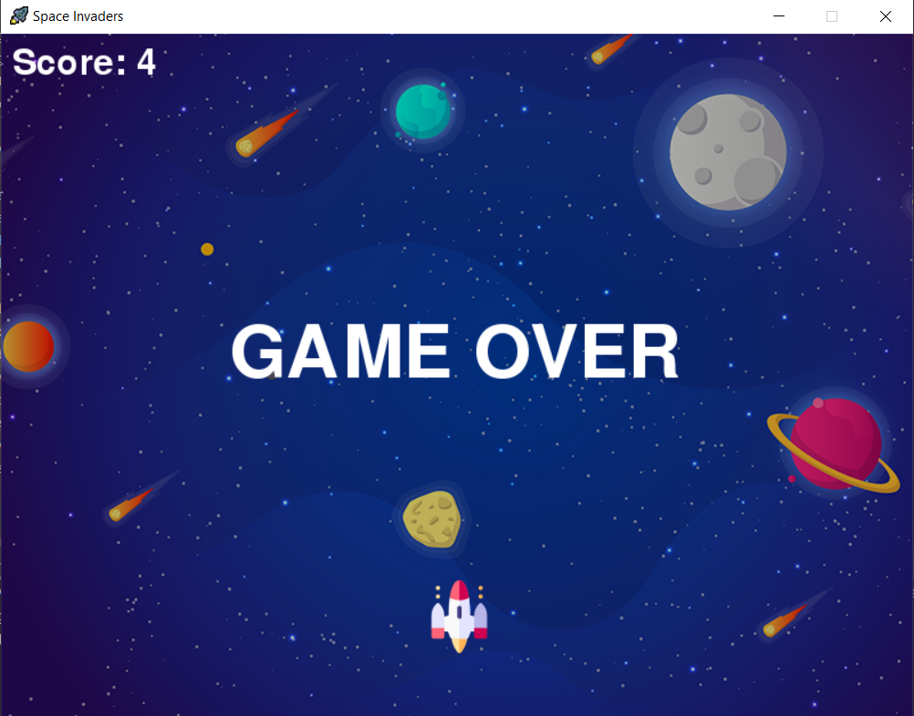

# Space Game
This is a game that is based on the popular Space Invaders game and uses the **pygame** module in **Python**.

## Features Added
* Background music and effect music for collisions

## How to Play
* Use the right and left arrow keys to move the spaceship
* Use the space bar to shoot bullets at the enemies
* <a href="https://repl.it/@snvellozzi/space-game" title="Play Here">Play Here</a> and run the game!

## Pygame GUI

### Credits for images/icons
<a href="https://www.freepik.com/vectors/background">Background vector created by freepik - www.freepik.com</a>

Icons made by <a href="https://www.flaticon.com/authors/pixel-perfect" title="Pixel perfect">Pixel perfect</a> from <a href="https://www.flaticon.com/" title="Flaticon">www.flaticon.com</a>

Icons made by <a href="https://www.flaticon.com/authors/freepik" title="Freepik">Freepik</a> from <a href="https://www.flaticon.com/" title="Flaticon">www.flaticon.com</a>

Icons made by <a href="https://www.flaticon.com/authors/smashicons" title="Smashicons">Smashicons</a> from <a href="https://www.flaticon.com/" title="Flaticon"> www.flaticon.com</a>
